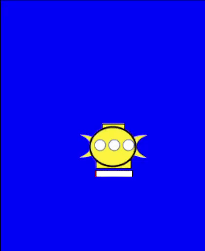

# Projet Balises et Satellites

## Constitution du groupe 

 - Lucas TANNÉ
 - Alan JACOB

## Correction du bogue

#### Problème

Le problème constaté lors de l'éxécution du programme initial concernait la synchronisation d'une balise avec un satellite.

La balise effectuait un deplacement, durant lequel elle recoltait diverses données, lorsque la mémoire de cette balise était pleine, elle remontait à la surface pour se synchroniser avec le premier satellite qu'elle croisait. 

Au lieu de vider sa mémoire à la synchronisation pour ensuite retourner recolter des données sur son deplacement interrompu dû à sa mémoire pleine, elle vidait sa mémoire dès qu'elle était remplie, avant de remonter pour se synchroniser, sauf que les données recommençait à se collecter durant la remontée et l'attente du satellite.

Donc, si jamais la remontée était grande et/ou l'attente était longue, dès qu'un satellite passait, sa mémoire était possiblement de nouveau pleine, et ainsi, elle sauvegardait son dernier mouvement, la remontée pour se synchroniser. Elle restait ainsi bloquer à la surface.

#### Correctif

Le vidage de mémoire se fait désormais lors de la synchronisation et la collecte des données ne s'effectue plus lors de la montée et la descente de la balise, et reprends lors de son déplacement normal (à la fin de la redescente *Redescendre.java).

*DeplSynchronisation*
```java
	public void whenSatelitteMoved(SatelliteMoved arg, Balise target) {
		if (this.synchro != null) return;
		Satellite sat = (Satellite) arg.getSource();
		int satX = sat.getPosition().x;
		int tarX = target.getPosition().x;
		if (satX > tarX - 10 && satX < tarX + 10) {
			if(!sat.memoryFull()) {
				this.synchro = sat;
				
				target.send(new SynchroEvent(this));
				this.synchro.send(new SynchroEvent(this));
				this.synchro.dataSize += target.dataSize();
				this.synchro.send(new DataChanged(this.synchro));
				target.resetData();
			}else {
				sat.setFull(true);
			}
		}
	}
```


Un boolean permet de verifier si on est en phase de synchronisation ou non.

*Balise.java*
```java
public void tick() {
		
		if (!whileSynchro)  {
				
			if (this.memoryFull()) {
			Deplacement redescendre = new Redescendre(this.deplacement(), this.profondeur(), this);
			Deplacement deplSynchro = new DeplSynchronisation(redescendre);
			Deplacement nextDepl = new MonteSurfacePourSynchro(deplSynchro);
			this.setDeplacement(nextDepl);
			this.setWhileSynchro(true);
			
			} else {
				this.readSensors();
			}
		}
		super.tick();
		
	}
}
```
## Ajout et amélioration

#### Deplacement sinusoïdale

Pour compléter l'ensemble de déplacement possible lors de collecte de données (horizontal et vertical), nous avons mis en place le déplacement sinusoïdales, permettant la collecte de données sur deux dimensions.

*DeplSinusoïdal*
```java
public void bouge(ElementMobile target) { 
		Point p = target.getPosition(); 
		int y = p.y; 
		int x = p.x; 
		if (monte) { 
			if(deplDroit) { 
				y -= 3; 
				x += 3; 
			} else { 
				y -= 3; 
				x -= 3; 
			}		 
			if (y < minY) monte = false; 
			if (x > maxX) { 
				deplDroit = false; 
			} else if (x < minX){ 
				deplDroit = true; 
			} 
		} else { 
			if(deplDroit) { 
				y += 3; 
				x += 3; 
			} else { 
				y += 3; 
				x -= 3; 
			}		 
			if (y > maxY) monte = true; 
			if (x > maxX) { 
				deplDroit = false; 
			} else if (x < minX){ 
				deplDroit = true; 
			} 
		} 
		target.setPosition(new Point(x, y)); 
	}
 ```
 
 
 
---

#### Echange de données

Lorsque la balise attends à la surface et qu'un satellite passe au dessus d'elle (dans un rayon de 10 unités), cette dernière lui trasnmet ses données avant de retourner à sa collecte dans les profondeurs.

Cet échange s'effectue au sein de la méthode whenSatelitteMoved de la classe DeplSynchronisation :

*DeplSynchronisation*
```java
public void whenSatelitteMoved(SatelliteMoved arg, Balise target) {
		if (this.synchro != null) return;
		Satellite sat = (Satellite) arg.getSource();
		int satX = sat.getPosition().x;
		int tarX = target.getPosition().x;
		if (satX > tarX - 10 && satX < tarX + 10) {
			this.synchro = sat;
			target.send(new SynchroEvent(this));
			this.synchro.send(new SynchroEvent(this));
			sat.dataSize += target.dataSize();
			target.resetData();
		}
}
```


***Echange impossible***

Lorsque la mémoire d'un satellite se retrouve pleine, ce dernier ne permet plus la synchronisation avec une balise. Ainsi une balise cherchera à se synchroniser avec un autre satellite.


---

#### Collecte de données

Ainsi, la collecte s'effectue maintenant seulement lors de son déplacement habituel.

Un boolean est passé à vrai quand la mémoire de la balise est pleine, et devient faux quand cette dernière à fini sa descente.

Lorsque le boolean est faux, il empeche de vérifier si la balise est pleine et d'accumuler des données à chaque unité de temps.


---

#### Barre de visualisation de données

Une barre de visualisation de données est avant tout une classe Java `GrBarData` composer de 2 rectangles:

```java
public class GrBarData extends GrElementMobile {
	
	private static final long serialVersionUID = 1L;

	private NiRectangle bar; 
	private NiRectangle barBg;
	
	public GrBarData(GrEther ether, int width, int locationX, int locationY) {
		super(ether);
		barBg = new NiRectangle();
		barBg.setBackground(Color.white);
		barBg.setDimension(new Dimension(width, 10));
		barBg.setLocation(locationX, locationY);
		
		bar = new NiRectangle();
		bar.setDimension(new Dimension(0, 10));
		barBg.add(bar);
	}
	
	public void setBarColor(Color color) {
		this.bar.setBackground(color);
	}
	
	public NiRectangle getBarBg() {
		return this.barBg;
	}
	
	public void setSizeBar(int width) {
		this.bar.setDimension(new Dimension(width/2, 10));
		this.repaint();
	}
}
```
Les satellites ainsi que les balises possèdent une barre permettant de constater l'évolution de leur collecte de données. C'est pourquoi le constructeur est construit de façon à s'adapter pour les 2 objets.<br>
On peut constater graphiquement le remplissage ainsi que la synchronisation des balises avec les satellites. Ceci permet de comprendre pourquoi des satellites n'accepte plus les synchronisation ou bien pourquoi les balises remontent.

**Balises**



**Satellites**


Pour faire ces barres de données, nous avons créer un nouvel évènement `DataChanged` et `DataChangedListener` qui vont être propager au moment ou une balise récolte de la donnée:

*Balise.java*
```java
protected void readSensors() {
	this.dataSize++;
	this.send(new DataChanged(this));
}
```
La classe `GrBalise` implémente donc l'interface `DataChangedListener` et sa méthode pour permettre de modifier graphiquement sa barre de données en lui envoyant sa taille calculer comme un pourcentage:

*GrBalise.java*
```java
@Override
public void whenDataChanged(DataChanged arg) {
	// TODO Auto-generated method stub
	Balise balise = (Balise)arg.getSource();
	if(balise.dataSize() == 0) {
		this.db.setSizeBar(0);
	}else {
		BigDecimal dataSize = new BigDecimal(balise.dataSize());
		BigDecimal memorySize = new BigDecimal(balise.memorySize());
		BigDecimal res = (dataSize.divide(memorySize, 2, RoundingMode.HALF_UP)).multiply(new BigDecimal(100));

		this.db.setSizeBar(res.intValue());
	}
}
```


---

#### Bateau de ramassage

Le bateau d'étude vient ramasser les balises une fois que l'ensemble des stockages de données satellites soit remplis. Il ramasse les balises quand elle remonte à la surface pour ne pas perdre les données récupérer.


**Contexte**

Le bateau de ramassage est comme une balise ou un satellite, il est constitué d'un model et d'une vue. Le bateau connait dès le départ combien de satellites sont dans le simulateur, il possède donc 3 propriétés:
- `nbSatellite` : nombre de satellite présent dans la simulation.
- `nbSatelliteFull` : nombre de satellite qui ont enregistré le maximum de données provenant des balises.
- `eventSatellite` : un `EventHandler` qui permet de mettre à jour les précédentes propriétés. 

L'enregistrement des satellites se font par un nouvel évènement `SatelliteLife`et `SatelliteLifeListener` implémenté par la vue du bateau `GrBateau` pour avoir accès aux deux méthodes `registerSatellite` et `satelliteFull`:

*GrBateau.java*
```java
@Override
public void registerSatellite(SatelliteLife arg) {
	// TODO Auto-generated method stub
	Bateau bateau = (Bateau)this.getModel();
	bateau.incrementeNbSatellite();
}

@Override
public void satelliteFull(SatelliteLife arg) {
	// TODO Auto-generated method stub
	Bateau bateau = (Bateau)this.getModel();
	bateau.incrementeNbSatelliteFull();
}
```

Ainsi du côté du model du satellite, dans le constructeur, nous avons propager l'évènement `SatelliteLife`, pour ce faire nous sommes partis du principe que les satellites connaissent le bateau de ramassage dans leurs zone dès le départ :

```java
public Satellite(int memorySize, Bateau bateau) {
	super(memorySize);
	this.eventData = new EventHandler();
	this.full = false;
	this.checked = false;
	this.bateau = bateau;
	this.bateau.send(new SatelliteLife(this));
}
```

La distinction entre un satellite qui s'enregistre auprès du bateau et un satellite avec la mémoire saturé se fait dans l'évènement `SatelliteLife.java` simplement par le test `satellite.isFull()`.

**Le ramassage**

Comme indiqué dans l'introduction de ce chapitre le bateau de ramassage se déplace une fois que tous les satellites ne peuvent plus se synchroniser avec les balises.
C'est donc dans la classe `Bateau`, lors de l'appel de la méthode `bouge()` appelé par le tick effectué par le manager, que le bateau check si tous les satellites enregistrés ont la mémoire pleine, ce n'est alors qu'à ce moment là qu'il va pouvoir se déplacer:

*Bateau.java*
```java
public void bouge () {
	if(this.allSatelliteFull()) {
		super.getManager().balisesReadyForPickUp();
		super.bouge();
		super.send(new BateauMoved(this));
	}
}

public boolean allSatelliteFull() {
	if(this.nbSatelliteFull != 0) {
		if(this.nbSatellite == this.nbSatelliteFull) {
			return true;
		}
	}
	return false;
}
```
Maintenant que le bateau se déplace une fois la condition respecter, il faut qu'il ramasse les balises mais seulement celles qui sont en attente de synchronisation (donc remonté à la surface).
Pour ce faire nous avons créer 2 nouveaux évènements distinct l'un de l'autre car ils n'ont pas la même utilités:

Le premier `BateauMoved` et `BateauMoveListener` va être propager quand le bateau va se déplacer. Les objets listener sont les balises, quand les balises vont recevoir cet évènement elle vont faire appel à une méthode dans leur stratégie de déplacement de synchronisation `DeplSynchronisation.java`.
Cette méthode va comme pour la synchronisation, vérifier si les deux objets sont dans la même zone :
*Balise.java*
```java
@Override
public void whenBateauMoved(BateauMoved arg) {
	// TODO Auto-generated method stub
	DeplacementBalise dp = (DeplacementBalise) this.depl;
	dp.whenBateauMoved(arg, this);
}
```
*DeplSynchronisation.java*
```java
@Override
public void whenBateauMoved(BateauMoved arg, Balise target) {
	Bateau bateau = (Bateau)arg.getSource();
	Point positionBalise = target.getPosition();
	Point positionBateau = bateau.getPosition();
	if(positionBalise.getX() == positionBateau.getX() + 10) {
		if(!target.isPickedUp()) {
			target.sendElementMobile(new BalisePickUp(target));
			target.setPickedUp(true);
		}
	}
}
```
On envoie en paramètre de l'évènement la balise qui remplis les conditions pour être ramassé.

Le second évènement `BalisePickUp` et `BalisePickUpListener` va être propager dans l'exemple au dessus, implémenté par la vue des balises `GrBalise`, c'est grace à ces objets que l'on va pouvoir récupérer leur model et tester si il correspond avec l'argument envoyé via l'évènement.
Si oui alors la balise est ramasé par le bateau, dans cette simulation nous avons imagé la ramassage par le fait de faire disparraisent visuellement la vue d'une balise en utilisant la méthode `setVisible(false)`:
*GrBalise.java*
```java
@Override
public void whenBalisePickedUp(BalisePickUp arg) {
	// TODO Auto-generated method stub
	Balise balise = (Balise)arg.getSource();
	Balise model = (Balise)this.getModel();
	if(balise == model) {
		this.setVisible(false);
		this.repaint();
	}
}
```

Le fait de ne pas détruire l'objet fait qu'il est ramasé à chaques fois que le bateau passe dessus, donc pour régler se petit problème nous avons rajouter un flag `pickedUp` dans la classe `Balise` qui indique si oui ou non la balise à déjà été ramassée.

Pour imagé tout ce chapitre, la démonstration ci-dessous montre comment les évènements fonctionnent visuellement:

